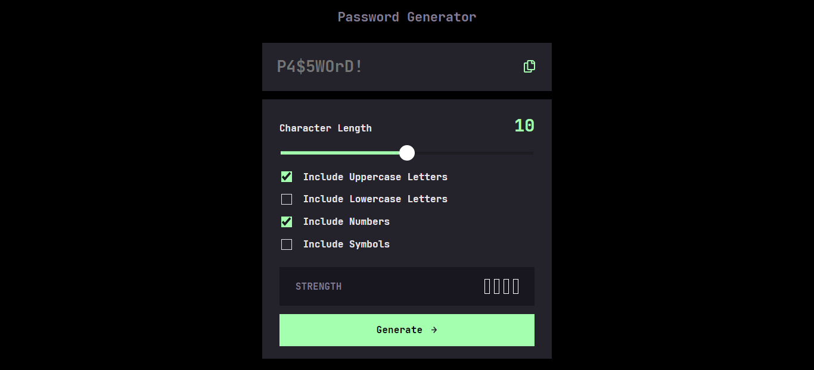
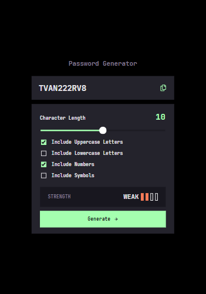
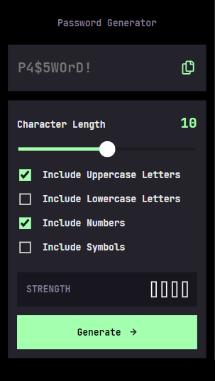

# Frontend Mentor - Password generator app solution

This is a solution to the [Password generator app challenge on Frontend Mentor](https://www.frontendmentor.io/challenges/password-generator-app-Mr8CLycqjh). Frontend Mentor challenges help you improve your coding skills by building realistic projects.

Created whit create-react-app.

### Install all dependencies

```
npm install
```

## Start the project

```
npm start
```


## Table of contents

- [Overview](#overview)
  - [The challenge](#the-challenge)
  - [Screenshot](#screenshot)
  - [Links](#links)
- [My process](#my-process)
  - [Built with](#built-with)
  - [What I learned](#what-i-learned)
  - [Continued development](#continued-development)
  - [Useful resources](#useful-resources)
- [Author](#author)

## Overview

### The challenge

Users should be able to:

- Generate a password based on the selected inclusion options
- Copy the generated password to the computer's clipboard
- See a strength rating for their generated password
- View the optimal layout for the interface depending on their device's screen size
- See hover states for all interactive elements on the page

### Screenshot





### Links

- Solution URL: [Solution](https://github.com/JimAxl1/Password-generator-app)
- Live Site URL: [Demo](https://password-generator-app-38d62.web.app)

## My process
I improved my skill with react and learned to include sass to a react project

### Built with

- Semantic HTML5 markup
- CSS
- Sass
- [React](https://reactjs.org/) - JS library
- React SOLID principles

### Continued development
I would like to improve in code, be a better developer and learn more tools about frontend.

### Useful resources

- [Stack Overflow](https://stackoverflow.com/) - It helped me to solve some problems during the development of the components that included the tag 'input' and the pseudoclasses in css

## Author

- Frontend Mentor - [@JimAxl1](https://www.frontendmentor.io/profile/JimAxl1)
- Github - [@JimAxl1](https://github.com/JimAxl1)